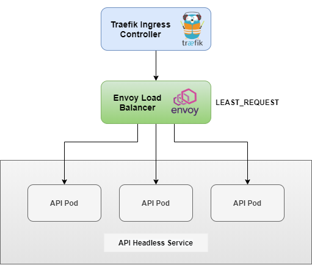

# Envoy proxy with K8S project

[](https://travis-ci.com/julio-cesar-development/envoy-proxy-k8s-project)
[](https://github.com/julio-cesar-development/envoy-proxy-k8s-project)


> This is a project to try out Envoy Proxy with Kubernetes

## About

> This project has a K8S deployment with 3 replicas of an API made with GoLang, a K8S headless service that resolves the DNS to the 3 replicas running on it.
> The Envoy is used to handle requests in this DNS of the K8S headless service and do the load balancing for the pods using the LEAST_REQUEST method

## Architecture



## Instructions

> Running locally with docker

```bash
docker-compose up -d
```

> In order to run the deployments in K8S, run the script deploy.sh

```bash
chmod +x ./deploy.sh && \
    bash ./deploy.sh

# to see info about K8S deployed objects
kubectl get pod,deploy,svc,ingress,limitrange -n envoy -o wide
```

> Access the ingress to see each request being redirected to a different pod

```bash
curl http://localhost
```

> Or get the IP of Envoy service, and access it on port 80

```bash
ENVOY_SVC_IP=$(kubectl get svc -n envoy --selector=app=envoy -o json | jq -r '.items[].spec.clusterIP')
curl http://${ENVOY_SVC_IP}
```

## Docs

> Envoy

<https://www.envoyproxy.io/docs/envoy/latest/start/start>

<https://www.envoyproxy.io/docs/envoy/latest/configuration/overview/examples>

<https://github.com/envoyproxy/envoy/tree/master/examples>

<https://www.envoyproxy.io/docs/envoy/v1.5.0/intro/deployment_types/service_to_service#service-to-service-egress-listener>

<https://blog.markvincze.com/how-to-use-envoy-as-a-load-balancer-in-kubernetes>

<https://www.envoyproxy.io/docs/envoy/latest/version_history/v1.14.0>

> Traefik

<https://docs.traefik.io/routing/services/#weighted-round-robin>

<https://docs.traefik.io/v1.7/configuration/backends/kubernetes/>

<https://docs.traefik.io/v1.7/user-guide/kubernetes/>

## Authors

[Julio Cesar](https://github.com/julio-cesar-development)

## License

This project is licensed under the MIT License - see the [LICENSE.md](LICENSE.md) file for details
